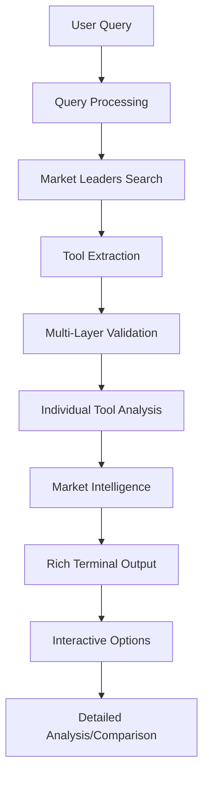

# 🚀 Developer Tools Research Agent CLI

<div align="center">


*An intelligent AI agent that revolutionizes how developers discover and analyze tools*

[](https://python.org)
[](https://langchain-ai.github.io/langgraph/)
[](https://groq.com)
[](LICENSE)

</div>

## 🎯 Overview

A sophisticated AI-powered research agent that eliminates the tedious process of manually researching developer tools. Instead of spending hours comparing databases, CI/CD platforms, or finding alternatives to existing tools, this agent delivers comprehensive analysis in seconds.

**The Problem:** Developers waste countless hours researching tools, reading documentation, and comparing features across multiple platforms.

**The Solution:** An intelligent agent that combines web scraping, AI analysis, and market intelligence to provide instant, comprehensive tool research.

## ✨ Key Features

<div align="center">

| Feature | Description | Impact |
|---------|-------------|---------|
| 🔍 **Smart Discovery** | Advanced search algorithms with developer-specific filtering | Find relevant tools, not random products |
| 📊 **Market Intelligence** | Business context, funding, company size, user metrics | Make informed decisions beyond just features |
| 🤖 **AI Analysis** | Deep technical analysis using Llama 3.3 70B | Get comprehensive insights in seconds |
| 🏆 **Market Leaders** | Top 5 tools in each category shown first | Understand the competitive landscape |
| 💡 **Rich Terminal UI** | Beautiful formatting with Rich library | Professional, clean user experience |
| 🔄 **Interactive Modes** | Detailed analysis, comparisons, export options | Flexible workflow for different needs |

</div>

## 🎬 Demo

```bash
🔍 Developer Tools Query: database tools for python

📊 Finding market leaders in database tools for python...
🏆 Top Market Leaders in Database Tools For Python:
────────────────────────────────────────────────────────────
1. PostgreSQL
2. MongoDB
3. Redis
4. SQLite
5. MySQL

🔍 Finding articles about: database tools for python
✅ Extracted tools: PostgreSQL, MongoDB, Redis, SQLAlchemy, Django ORM
🔬 Researching specific tools: PostgreSQL, MongoDB, Redis, SQLAlchemy

[Detailed analysis cards for each tool...]
```

## 🏗️ System Architecture

<div align="center">


*LangGraph State Machine Architecture*

</div>

### 🔄 Core Workflow

The system implements a sophisticated **LangGraph state machine** with specialized processing nodes:



### 🧠 Intelligent Components

#### 1. **Multi-Layer Tool Validation System**
```python
# Advanced filtering logic
exclude_patterns = ["watch", "jewelry", "fashion", "restaurant"]
include_patterns = ["api", "sdk", "framework", "platform", "tool"]
known_dev_tools = ["jenkins", "docker", "react", "postgresql"]
```

- **Pattern Matching**: Filters out 50+ non-developer business categories
- **Whitelist Validation**: 100+ known legitimate developer tools
- **Context Awareness**: Smart handling of ambiguous terms like "monitor"
- **Technical Indicators**: Detects developer-specific terminology

#### 2. **Enhanced Search Strategy**
```python
# Optimized search queries
dev_terms = "developer tools software engineering programming"
search_query = f"best {query} {dev_terms} comparison top tools 2024"
```

- **Developer-Focused Terms**: Targets technical content sources
- **Query Optimization**: Improves search result relevance
- **Fallback Mechanisms**: Handles edge cases and alternative searches

#### 3. **Market Intelligence Engine**
- **Company Analysis**: Size, funding status, market position
- **User Metrics**: Base size, GitHub stars, adoption trends
- **Competitive Positioning**: Leader/Challenger/Niche/Emerging classification
- **Integration Mapping**: Compatible tools and platforms

## 🛠️ Technology Stack

<div align="center">

| Technology | Purpose | Why Chosen |
|------------|---------|------------|
|  | Workflow orchestration | Advanced agent workflows with persistence |
|  | High-speed AI inference | 10x faster than traditional APIs |
|  | LLM application framework | Industry standard for AI apps |
|  | Content extraction | Reliable, structured web data |
|  | Beautiful terminal interface | Professional user experience |
|  | Type-safe data models | Robust data handling |
|  | Fast dependency management | 10-100x faster than pip |

</div>

### 🚀 Performance Optimizations

- **Groq's LPU Architecture**: Delivers inference speeds up to 500 tokens/second
- **Concurrent Processing**: Parallel tool analysis for faster results
- **Smart Caching**: Reduces redundant API calls
- **Efficient State Management**: LangGraph's optimized workflow execution

## 📋 Prerequisites

- Python 3.8+
- UV package manager
- API keys for Groq and Firecrawl

## 🚀 Quick Start Guide

### 📋 Prerequisites

<div align="center">


</div>

### 1️⃣ Clone & Setup

```bash
# Clone the repository
git clone https://github.com/Saket2713/developer-tools-research-agent.git
cd developer-tools-research-agent

# Install UV (if not already installed)
curl -LsSf https://astral.sh/uv/install.sh | sh

# Install dependencies
cd advanced-agent
uv sync
```

### 2️⃣ API Configuration

Create a `.env` file in the `advanced-agent` directory:

```env
# Required API Keys
GROQ_API_KEY=your_groq_api_key_here
FIRECRAWL_API_KEY=your_firecrawl_api_key_here
```

### 3️⃣ Get API Keys

<details>
<summary><b>🔑 Groq API Key (Free Tier Available)</b></summary>

1. Visit [console.groq.com](https://console.groq.com)
2. Sign up with GitHub/Google
3. Navigate to **API Keys** section
4. Click **Create API Key**
5. Copy the key to your `.env` file

**Free Tier Limits:**
- 30 requests/minute
- 6,000 tokens/minute
- Perfect for testing and light usage

</details>

<details>
<summary><b>🔥 Firecrawl API Key (Free Tier Available)</b></summary>

1. Visit [firecrawl.dev](https://firecrawl.dev)
2. Sign up for an account
3. Go to **Dashboard** → **API Keys**
4. Copy your API key
5. Add to your `.env` file

**Free Tier Limits:**
- 500 requests/month
- Sufficient for regular usage

</details>

### 4️⃣ Launch the Agent

```bash
cd advanced-agent
uv run main.py
```

<div align="center">

🎉 **You're ready to discover amazing developer tools!**

</div>

## 💡 Usage Examples & Real Results

### 🔍 Basic Tool Search
```bash
🔍 Developer Tools Query: database tools for python

📊 Finding market leaders in database tools for python...
🏆 Top Market Leaders:
1. PostgreSQL    2. MongoDB    3. Redis    4. SQLite    5. MySQL

✅ Extracted tools: PostgreSQL, MongoDB, Redis, SQLAlchemy, Django ORM
```

### 🔄 Alternative Discovery
```bash
🔍 Developer Tools Query: alternative to jenkins

🏆 Top Alternatives to Jenkins:
1. GitHub Actions    2. GitLab CI    3. CircleCI    4. Azure DevOps
```

### 📊 Category Exploration
```bash
🔍 Developer Tools Query: ci/cd platforms

🏆 Market Leaders: CircleCI, GitLab CI/CD, GitHub Actions, Google Cloud Build
✅ Analysis: Pricing, features, integrations, market position for each
```

### 🎬 Interactive Demo
```bash
🔍 Developer Tools Query: demo
# Runs a quick demonstration with sample data
```

### 🎯 Advanced Queries
```bash
# Specific use cases
"monitoring tools for microservices"
"database for real-time analytics"
"code editors with AI features"
"free alternatives to datadog"
```

## 🎨 Rich Output Features

<div align="center">


*Clean, professional terminal interface with rich formatting*

</div>

### 📊 Comprehensive Analysis Cards

Each tool receives a detailed analysis card containing:

```
┌─ PostgreSQL ─────────────────────────────────────────────┐
│ 🏢 Company: PostgreSQL Global Development Group          │
│ 💰 Pricing: Open Source (Free)                          │
│ 🔧 Type: Relational Database                            │
│ ⭐ GitHub Stars: 15,000+                                 │
│ 📈 Market Position: Leader                              │
│                                                          │
│ 🚀 Key Features:                                        │
│ • ACID compliance                                        │
│ • Advanced indexing                                      │
│ • JSON support                                          │
│ • Extensible architecture                               │
│                                                          │
│ 🔗 Integrations: Django, SQLAlchemy, Prisma, Hasura    │
│ 💼 Best For: Enterprise applications, complex queries   │
└──────────────────────────────────────────────────────────┘
```

### 🎯 Interactive Features

- **📋 Detailed Analysis**: Deep dive into specific tools
- **⚖️ Comparison Mode**: Side-by-side tool comparisons
- **📤 Export Options**: Save results as JSON/CSV
- **🎬 Demo Mode**: Quick showcase with sample data

## ⚙️ Advanced Configuration

### 🤖 Model Selection

<div align="center">

| Model | Speed | Quality | Use Case |
|-------|-------|---------|----------|
| `llama-3.1-8b-instant` | ⚡ Very Fast | ✅ Good | Quick searches, high volume |
| `llama-3.3-70b-versatile` | 🐌 Slower | 🎯 Excellent | Detailed analysis, complex queries |

</div>

```python
# In src/workflow.py
ChatGroq(
    model="llama-3.1-8b-instant",  # Current default
    temperature=0.1,
    max_tokens=4000
)
```

### 🔍 Search Customization

```python
# In src/prompts.py - Customize validation rules
exclude_patterns = [
    "watch", "jewelry", "fashion",  # Add more non-dev categories
    "restaurant", "hotel", "travel"
]

known_dev_tools = [
    "jenkins", "docker", "react",   # Add more legitimate tools
    "postgresql", "kubernetes"
]
```

### 🎛️ Performance Tuning

```python
# Adjust concurrent processing
max_concurrent_tools = 4  # Reduce for rate limit management
search_results_limit = 3  # Increase for more comprehensive results
```

## 🧪 Testing & Validation

### Run Precision Tests
```bash
# Test tool validation across categories
uv run test_precision.py

# Expected output: 5/6 categories passing with high precision
```

### Manual Testing
```bash
# Test different query types
uv run main.py
# Try: "database tools", "ci/cd platforms", "code editors"
```

## 🤝 Contributing

<div align="center">

[](CONTRIBUTING.md)

</div>

We welcome contributions! Here's how to get started:

1. **🍴 Fork** the repository
2. **🌿 Create** a feature branch (`git checkout -b feature/amazing-feature`)
3. **✨ Make** your changes with proper tests
4. **📝 Commit** with clear messages (`git commit -m 'Add amazing feature'`)
5. **🚀 Push** to your branch (`git push origin feature/amazing-feature`)
6. **🔄 Open** a Pull Request

See [CONTRIBUTING.md](CONTRIBUTING.md) for detailed guidelines.

## 📊 Project Stats

<div align="center">


</div>

## 📄 License

This project is licensed under the **MIT License** - see the [LICENSE](LICENSE) file for details.

## 🙏 Acknowledgments

<div align="center">

**Built with amazing open-source technologies**

[](https://groq.com)
[](https://langchain.com)
[](https://langchain-ai.github.io/langgraph/)

</div>

- **Groq** for lightning-fast LLM inference
- **LangChain & LangGraph** for robust AI application framework
- **Firecrawl** for reliable web scraping capabilities
- **Rich** for beautiful terminal formatting
- **UV** for blazing-fast package management

---

<div align="center">

**⭐ Star this repo if it helped you discover amazing developer tools! ⭐**

*Made with ❤️ for the developer community*

</div>
